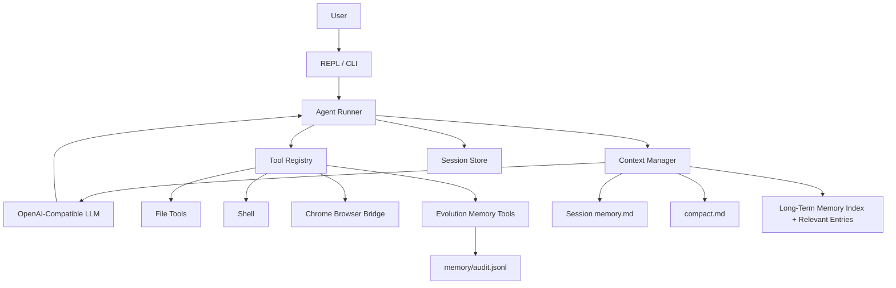

<div align="center">
  <h1 align="center">Cohert</h1>
  <p align="center">
    A local-first command-line Agent Runtime for tools, browser automation, long-context work, SOPs, and verified memory.
  </p>
</div>

<p align="center">
  
  
  
  
  
</p>

<p align="center">
  <a href="#quick-start">Quick Start</a>
  ·
  <a href="#features">Features</a>
  ·
  <a href="#architecture">Architecture</a>
  ·
  <a href="#memory">Memory</a>
  ·
  <a href="docs/usage.md">Usage Guide</a>
</p>

---

## What Is Cohert

Cohert is a Go-based local Agent Runtime. It connects an OpenAI-compatible LLM with a controlled tool layer, persistent sessions, browser automation, context compaction, SOP routing, and verified long-term memory.

It is designed for real local work rather than pure chat:

```text
User intent
  -> Agent loop
  -> Context Manager
  -> LLM tool calling
  -> Local tools / browser / shell
  -> Evidence ledger
  -> Session history and verified memory
```

The core idea is simple: let the model reason, but make execution explicit, auditable, recoverable, and memory-aware.

## Quick Start

```bash
git clone <repo-url>
cd Cohort
export DEEPSEEK_API_KEY="sk-xxx"
go run .
```

Run a one-shot task:

```bash
go run . ask "read README.md and summarize the current runtime capabilities"
```

Inspect the runtime:

```bash
go run . config
go run . tools
go run . session list
```

Build:

```bash
go build -o cohert ./cmd/cohert
./cohert
```

Default configuration lives in [`configs/config.yaml`](configs/config.yaml). Full usage is documented in [`docs/usage.md`](docs/usage.md).

## Features

| Area | Capability |
| --- | --- |
| Agent Loop | Streaming OpenAI-compatible chat, tool calling, max-turn control, visible action notes |
| Local Tools | File read/write/patch, shell execution, user questions, structured tool errors |
| Browser Automation | Chrome bridge, page open/scan, JS execution, element snapshot, click/type/key/wait/screenshot |
| Session System | `history.jsonl`, metadata, session list, resume, local audit trail |
| Context Manager | Tool-result compaction, group-safe trimming, session memory, full compact summaries |
| SOP Runtime | SOP index injection, task-based SOP hints, working checkpoints after SOP reads |
| Evolution Memory | Verified evidence, structured memory entries, project memory, duplicate checks, read-back confirmation |
| Observability | Model response logs, context stats logs, memory audit records |

## Command Surface

External CLI:

```bash
cohert                         # start interactive mode
cohert ask "task"              # run one task and exit
cohert tools                   # list mounted tools
cohert config                  # show effective config
cohert session list            # list local sessions
cohert session resume <id>     # resume a session
```

Development entrypoints:

```bash
go run .
go run . ask "task"
go run . tools
go run . config
```

Interactive slash commands:

```text
/help
/model
/config
/tools
/session
/session list
/session memory
/resume <session_id>
/compact
/full-compact
/memory
/clear
/exit
```

## Architecture



### Runtime Layers

| Layer | Package | Role |
| --- | --- | --- |
| App assembly | `internal/app` | Config, LLM client, tool registry, system prompt |
| Agent loop | `internal/agent` | Tool-call loop, history, compact generation, evidence collection |
| Context manager | `internal/contextmgr` | Request construction, compaction, memory injection |
| Tool runtime | `internal/tools` | Local file, shell, browser, memory, checkpoint tools |
| Browser bridge | `internal/browser` | WebSocket bridge between Cohert and Chrome extension |
| Session store | `internal/session` | `meta.json`, `history.jsonl`, list/resume |
| Evolution memory | `internal/evolution` | Safe memory structure, validation, write audit |

## Tools

<details>
<summary>Registered tools</summary>

```text
file_read
file_write
file_patch
code_run
ask_user
update_working_checkpoint
start_long_term_update
memory_propose_update
memory_apply_update
browser_tabs
browser_open
browser_scan
browser_dom_summary
browser_execute_js
browser_click
browser_click_element
browser_type
browser_type_element
browser_press_key
browser_snapshot
browser_wait_for_load
browser_wait_for_selector
browser_wait_for_text
browser_wait_for_url
browser_wait_for_stable
browser_screenshot
browser_ocr
desktop_permissions
desktop_windows
desktop_activate
desktop_screenshot
desktop_ax_snapshot
desktop_ocr
desktop_ax_press
```

</details>

## Browser Automation

Cohert can control Chrome through a local Browser Bridge:

```text
ws://127.0.0.1:18777/browser
```

Browser tasks follow a conservative interaction lifecycle:

```text
open
  -> wait for load
  -> wait for stable state
  -> snapshot interactive elements
  -> click / type / press key
  -> wait for selector / text / URL / stable state
  -> verify result
```

When DOM text and `browser_dom_summary` cannot read rendered text, `browser_ocr` can process a workspace image or capture the current browser viewport. It returns text with `screenshot-local` bounding boxes and never performs clicks. Install its optional local dependencies manually:

```bash
python3 -m pip install rapidocr-onnxruntime pillow numpy
```

If browser tools return `browser_not_connected`, load the Chrome extension from:

```text
assert/cohert_browser_bridge
```

## Desktop Computer Use (M1 + M2.1)

Cohert now provides a macOS-only, read-only desktop sensing foundation. It is intentionally generic rather than application-specific:

```text
desktop_permissions
  -> desktop_windows
  -> desktop_activate
  -> desktop_ax_snapshot
  -> desktop_screenshot
  -> desktop_ocr
  -> desktop_ax_press
```

Accessibility/AX controls are preferred over OCR. `desktop_ax_press` is the only desktop input action: it requires an active PID and exact fresh AX node metadata, checks the node again before action, then verifies an AX state change. R2 external actions require a one-time `ask_user` confirmation token; R3 high-risk actions are refused. Desktop screenshots and OCR bounding boxes use `screenshot-local` coordinates and cannot be treated as system mouse coordinates. There is still no desktop coordinate click, keyboard, or text-input tool.

Install macOS helper dependencies manually:

```bash
python3 -m pip install pyobjc-framework-Quartz pyobjc-framework-Cocoa pyobjc-framework-ApplicationServices
```

Grant the terminal or IDE running Cohert both Accessibility and Screen Recording permissions in macOS System Settings before using desktop sensing.

## Context Management

Cohert keeps full history on disk, but constructs a controlled request window before each model call.

It can:

- Drop protocol-invalid orphan tool results.
- Inject long-term memory index and matched memory entries.
- Inject session `memory.md`.
- Inject session `compact.md`.
- Compact old tool outputs into head/tail summaries.
- Trim old history by message group without splitting tool-call protocol pairs.

Default context settings:

```yaml
context:
  max_history_messages: 40
  keep_recent_tool_results: 2
  max_tool_result_chars: 12000
  compacted_tool_head_chars: 4000
  compacted_tool_tail_chars: 4000
  max_request_chars: 100000
  max_session_memory_chars: 20000
  max_memory_index_chars: 12000
  max_relevant_memory_chars: 16000
  max_relevant_memory_entries: 3
  max_compact_summary_chars: 60000
  enable_micro_compact: true
```

Context decisions are logged to:

```text
temp/model_responses/context.log
```

The log records stats only, not raw message content.

## Sessions

Sessions are stored locally:

```text
temp/sessions/<session_id>/
  meta.json
  history.jsonl
  memory.md
  compact.md
```

`history.jsonl` is the source of truth. Context compaction never mutates it; it only affects the request copy sent to the model.

Useful commands:

```bash
go run . session list
go run . session resume <session_id>
```

Inside REPL:

```text
/compact        # generate or update session memory.md
/full-compact   # generate or update compact.md
/memory         # inspect current session memory
```

## SOP Runtime

Cohert uses SOPs as lightweight operational constraints. The system prompt injects [`sops/index.md`](sops/index.md) as navigation, not as full SOP content.

When a task matches an SOP scene, the Runner hints the model to read the relevant SOP first. If the SOP is adopted, the model should call:

```text
update_working_checkpoint
```

The checkpoint stores concise task constraints and `related_sop`, so long-running tasks can recover the operating rules without rereading the whole conversation.

Current SOPs:

```text
sops/meta_sop.md
sops/browser_sop.md
sops/code_run_sop.md
sops/file_edit_sop.md
sops/context_sop.md
sops/memory_sop.md
sops/testing_sop.md
```

SOP and skill assets follow a small capability ladder:

```text
C0 atomic tools
  -> C1 SOP constraints
  -> C2 working checkpoint
  -> C3 verified long-term memory entry
  -> C4 SOP candidate
  -> C5 reviewed SOP / Skill in sops/index.md
```

This keeps reusable workflows discoverable without promoting every one-off task into an active rule.

## Memory

Cohert has a controlled long-term memory pipeline:

```text
start_long_term_update
  -> memory_propose_update
  -> memory_apply_update
```

Memory lives under the configured workspace:

```text
workspace/
  memory/
    index.md
    global.md
    projects/
      <project_id>/
        project.md
    reflection/
      sop_candidates.md
    audit.jsonl
```

Memory writes are intentionally strict:

- Candidates must reference verified evidence collected during tool execution.
- Only append actions are allowed.
- Sensitive content is rejected.
- Duplicate memory content is rejected.
- Writes are read back before success is returned.
- Every apply writes an audit record.

Structured memory entries use:

```text
scene
trigger_keywords
lesson
recommended_steps
evidence_ids
```

On later tasks, Cohert performs entry-level matching against `scene`, `trigger_keywords`, and task text, then injects only the most relevant entries. It does not blindly load entire memory files.

Stable workflows can be proposed as SOP candidates:

```text
memory/reflection/sop_candidates.md
```

They are not automatically promoted into active SOP files. Promotion remains a reviewed step:

```text
/sop candidates
/sop promote <candidate_id>
/sop promote <candidate_id> --confirm-index
```

The default promotion writes the reviewed SOP file only. Updating [`sops/index.md`](sops/index.md) requires explicit confirmation so new skills do not enter active routing accidentally.

## Configuration

Minimal configuration:

```yaml
language: zh
workspace: ./workspace
log_dir: ./temp/model_responses
max_turns: 100

llm:
  provider: openai
  name: deepseek
  api_key: ${DEEPSEEK_API_KEY}
  api_base: https://api.deepseek.com
  model: deepseek-v4-pro
  stream: true
```

The current client uses OpenAI-compatible Chat Completions. `deepseek-v4-pro` / `dsv4pro` are resolved as large-context models by the app layer.

## Project Layout

```text
cmd/cohert/             CLI entrypoint
configs/                local configuration
docs/                   usage guides, design notes, development records
internal/app/           application assembly and system prompt
internal/agent/         agent loop, compact generation, evidence flow
internal/browser/       Chrome bridge server and protocol
internal/cli/           external CLI commands
internal/contextmgr/    request construction, compaction, memory injection
internal/evolution/     verified memory validation, write, audit
internal/llm/           OpenAI-compatible LLM client
internal/repl/          interactive shell and slash commands
internal/session/       session metadata and history storage
internal/tools/         file, shell, browser, memory, checkpoint tools
sops/                   SOP index and operational playbooks
workspace/              default local workspace
temp/                   sessions and runtime logs
assert/                 browser bridge extension assets
```

## Development

```bash
go test ./...
go vet ./...
go run . tools
go run . config
```

## Design Principles

- Local first: execution, browser control, sessions, logs, and memory are local by default.
- Auditable tools: actions flow through schemas, structured outputs, and explicit errors.
- Immutable history: `history.jsonl` is preserved even when request context is compacted.
- Layered context: SOPs, session memory, full compact, and long-term memory have separate roles.
- Verified memory: durable memory requires evidence; model guesses do not become facts.
- Progressive evolution: keep the runtime stable before adding UI, plugins, multi-agent orchestration, or heavier retrieval.
