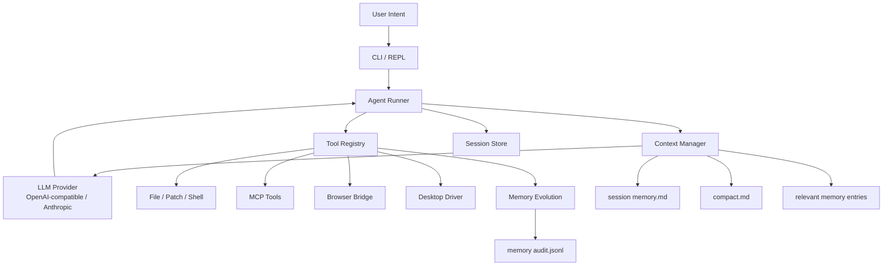

<div align="center">
  <h1 align="center">Cohort</h1>
  <p align="center">
    <strong>Local-first Agent Runtime for Real-World Workflows</strong>
  </p>
  <p align="center">
    面向真实任务的本地 Agent 执行内核。
    <br />
    把 OpenAI-compatible / Anthropic 模型接入受控工具、浏览器、桌面、MCP、上下文治理与可验证记忆，
    <br />
    让 Agent 不只会回答，而是能在真实环境里稳定行动、恢复和沉淀经验。
  </p>
</div>

<p align="center">
  
  
  
  
  
  
  
  
  
</p>

<p align="center">
  <b>简体中文</b>
  ·
  <a href="docs/readme/README.en.md">English</a>
  ·
  <a href="docs/readme/README.ja.md">日本語</a>
  ·
  <a href="docs/readme/README.ko.md">한국어</a>
  ·
  <a href="docs/readme/README.es.md">Español</a>
  ·
  <a href="docs/readme/README.fr.md">Français</a>
  ·
  <a href="docs/readme/README.hi.md">हिन्दी</a>
</p>

<p align="center">
  
</p>

<p align="center">
  <a href="#30-秒看懂-cohort">30 秒看懂</a>
  ·
  <a href="#项目叙事">项目叙事</a>
  ·
  <a href="#为什么是-cohort">为什么是 Cohort</a>
  ·
  <a href="#快速开始">快速开始</a>
  ·
  <a href="#ai-api-接入">AI API 接入</a>
  ·
  <a href="#真实示例">真实示例</a>
  ·
  <a href="#当前边界">当前边界</a>
  ·
  <a href="#能力矩阵">能力矩阵</a>
  ·
  <a href="#系统架构">系统架构</a>
  ·
  <a href="#安全模型">安全模型</a>
  ·
  <a href="#项目结构">项目结构</a>
  ·
  <a href="docs/usage.md">使用文档</a>
</p>

---

## 30 秒看懂 Cohort

Cohort 是一个本地优先的 Agent Runtime。它不绑定某一个模型厂商，而是把 OpenAI-compatible 或 Anthropic 协议的模型，接到一套可审计、可恢复、可扩展的本地执行系统上。

你可以把它理解成 Agent 的运行时层：

- 模型负责理解目标、规划步骤和调用工具。
- Runtime 负责权限、工具边界、浏览器/桌面动作、上下文治理、历史记录和安全恢复。
- 任务过程会落到本地 session、日志、截图、记忆和审计文件中，方便复盘与继续执行。

```bash
npm install -g @cohort-ai/cohort@latest
cohort init --provider deepseek   # 或 local / anthropic
export DEEPSEEK_API_KEY="sk-xxx"
cohort doctor
cohort --version
cohort
```

| 你得到什么 | Cohort 怎么做 |
| --- | --- |
| 真实执行闭环 | LLM 负责推理，runtime 负责工具、权限、证据和恢复 |
| 浏览器自动化 | 通过 Chrome Bridge 读 DOM、执行 JS、点击、输入、等待和截图 |
| 桌面 Computer Use | 基于 macOS Accessibility / AX 做窗口、控件、键盘和受控动作 |
| 长任务能力 | session、history、compact、memory 分层管理上下文 |
| 可验证记忆 | 长期记忆必须引用工具证据，写入后回读确认 |
| 可观测性 | 本地 `run.log.jsonl`，可选 Langfuse trace 上报 |

> 我们并不缺新的聊天框。  
> 我们缺的是一个足够可靠的运行时层, 让模型的判断可以穿过工具、浏览器、桌面和长期任务，真正抵达现实世界。

## 项目叙事

过去两年，Agent 领域最热闹的部分往往也是最脆弱的部分。

模型已经能写代码、能读网页、能理解复杂目标，甚至能在 benchmark 里看起来像一个“会做事的人”。  
但一旦进入真实环境，问题很快暴露出来:

- 它知道下一步该做什么，却没有稳定的执行路径。
- 它可以调用工具，却没有足够强的约束、审计和恢复机制。
- 它能记住一点东西，却记不清什么是事实、什么只是一次成功的幻觉。
- 它能跑一段 demo，却很难跨过长任务、长上下文和真实副作用的门槛。

这就是 Cohort 想要解决的核心矛盾。

我们不是把大模型再包一层 UI，也不是再做一个提示词更花哨的 Agent 壳。  
我们想做的是更底层的一层东西: 一个真正意义上的 <strong>Agent Runtime</strong>。

它的职责不是替模型思考，而是替系统建立秩序:

- 给推理一个可执行的落点。
- 给工具一个统一、受控、可恢复的运行边界。
- 给长任务一个不会失控的上下文系统。
- 给记忆一个可以被验证、被审计、被演化的生命周期。

如果说大模型提供的是 intelligence，  
那么 Cohort 试图补上的，是 intelligence 落地之前最缺的那层 infrastructure。

## 为什么是 Cohort

大部分 Agent Demo 的问题不是“不会想”，而是“不能稳定做事”。

- 模型能调用工具，但执行链路不可审计。
- 上下文越来越长，最后只能硬截断。
- 浏览器和桌面自动化混在 prompt 里，失败后很难恢复。
- 记忆是模型随手写下的摘要，不是有证据的事实。

Cohort 的判断很明确:

> 真正可用的 Agent，不该建立在“模型这次刚好没出错”的侥幸上。  
> 它应该建立在 runtime 的边界、证据、恢复能力和长期演化能力之上。

所以 Cohort 的目标不是炫技式地证明“模型能做到什么”，而是工程化地回答另一个问题:

**当 Agent 进入真实工作流之后，它如何持续、稳定、可追踪地完成任务。**

| 方向 | Cohort 的处理方式 |
| --- | --- |
| 执行 | 用受控工具层连接文件、Shell、浏览器、桌面、MCP |
| 长任务 | 用 session、compact、memory 分层管理长上下文 |
| 可恢复 | 每次任务都有 `history.jsonl` 和 session 元数据 |
| 可验证 | 长期记忆必须引用工具证据，写入后回读确认 |
| 自动化 | 浏览器优先 DOM，桌面优先 AX，避免纯视觉瞎点 |
| 演化 | SOP、checkpoint、memory candidate 分层升级，而不是一次性 prompt 魔法 |

换句话说，Cohort 关心的不是“像不像人”，而是更底层也更重要的三件事:

- 能不能安全地行动。
- 能不能在失败后恢复。
- 能不能把一次性的成功沉淀成长期能力。

## 快速开始

### 1. 安装 Cohort

推荐使用 npm 官方 registry 全局安装。npm 包会从 GitHub Release 下载匹配当前 macOS 架构的 `cohort` 二进制并校验 SHA256，同时随包提供 Chrome Bridge 扩展、macOS desktop helper 和 OCR helper。当前已验证版本为 `v1.0.0`。

```bash
npm install -g @cohort-ai/cohort@latest
cohort --version
```

如果不想走 npm，也可以使用 GitHub installer：

```bash
curl -fsSL https://raw.githubusercontent.com/congchuanling-dot/Cohort/master/scripts/install.sh | sh -s -- --repo https://github.com/congchuanling-dot/Cohort.git
export PATH="$HOME/.cohort/bin:$PATH"
```

如果是在源码仓库内开发：

```bash
git clone https://github.com/congchuanling-dot/Cohort.git
cd Cohort
./scripts/install.sh
export PATH="$HOME/.cohort/bin:$PATH"
```

### 2. 选择 AI API

Cohort 不是 DeepSeek 专用。它原生支持两类 API 协议：

| 协议 | 适合接入 | provider |
| --- | --- | --- |
| OpenAI-compatible Chat Completions | DeepSeek、OpenAI、Ollama、LM Studio、OpenRouter、兼容 `/v1/chat/completions` 的网关 | `openai` |
| Anthropic Messages API | Claude / Anthropic 原生 API | `anthropic` |

最快方式是用 `cohort init` 生成用户级配置，然后设置对应环境变量。下面三组按需选择一组即可；如果要覆盖已有配置，再追加 `--force`。

DeepSeek 或其他 OpenAI-compatible 云服务：

```bash
cohort init --provider deepseek
export DEEPSEEK_API_KEY="sk-xxx"
```

本地 OpenAI-compatible 服务，例如 Ollama / LM Studio：

```bash
cohort init --provider local
export LOCAL_OPENAI_API_KEY="local"
```

Anthropic Claude：

```bash
cohort init --provider anthropic
export ANTHROPIC_API_KEY="sk-ant-xxx"
```

也可以直接编辑 `~/.cohort/config.yaml`，把 `llm.active_profile` 指向你要使用的 profile。完整写法见 [AI API 接入](#ai-api-接入)。

### 3. 检查运行环境

```bash
cohort config
cohort doctor
cohort doctor computer
```

`doctor` 会检查配置、API key、工作区和日志目录。`doctor computer` 会检查 macOS Accessibility、Screen Recording、desktop helper、OCR helper、Chrome Bridge 和 artifact 目录；默认只读诊断，不会点击、输入或修改系统设置。

浏览器工具需要加载本地 Chrome Bridge 扩展：

```bash
cohort extension open
```

然后在 `chrome://extensions` 开启 Developer mode，点击 `Load unpacked`，选择命令输出的扩展目录。

### 4. 开始使用

```bash
cohort
```

进入交互模式后直接输入任务，例如：

```text
读取当前项目 README，总结架构并指出安装步骤是否清晰
打开豆包网页，发送“你好”，观察它的回复
列出当前桌面窗口，告诉我哪些窗口可以被安全自动化
```

也可以执行一次性任务：

```bash
cohort ask "读取 README.md，并用 8 条 bullet 总结 Cohort 的核心能力"
```

常用命令：

```bash
cohort tools
cohort config
cohort session list
cohort mcp list
cohort mcp status
cohort skill list
```

### 5. 源码开发

```bash
git clone https://github.com/congchuanling-dot/Cohort.git
cd Cohort
go run . config
go run . tools
go run . ask "读取 configs/config.yaml 并解释关键字段"
go build -o cohort ./cmd/cohort
./cohort
```

默认项目配置见 [configs/config.yaml](configs/config.yaml)。全局运行时会按 `--config`、`COHORT_CONFIG`、项目配置、`~/.cohort/config.yaml` 的顺序查找配置。更完整的命令和 REPL 说明见 [docs/usage.md](docs/usage.md)。

## AI API 接入

Cohort 的模型层按“协议”接入，而不是按单一厂商硬编码。只要服务兼容 OpenAI Chat Completions，通常都可以通过 `provider: openai` 接入；Anthropic Claude 使用 `provider: anthropic`。

### OpenAI-compatible 云服务

适合 DeepSeek、OpenAI、OpenRouter、兼容网关等服务。核心字段是 `api_base`、`api_key`、`model`。

```yaml
llm:
  active_profile: deepseek
  profiles:
    deepseek:
      provider: openai
      name: deepseek
      api_key: ${DEEPSEEK_API_KEY}
      api_base: https://api.deepseek.com
      model: deepseek-v4-pro
      stream: true

    openai:
      provider: openai
      name: openai
      api_key: ${OPENAI_API_KEY}
      api_base: https://api.openai.com
      model: gpt-4.1
      stream: true
```

使用时切换 `active_profile`，并设置对应环境变量：

```bash
export DEEPSEEK_API_KEY="sk-xxx"
export OPENAI_API_KEY="sk-xxx"
cohort config
cohort doctor
```

### 本地模型：Ollama / LM Studio

只要本地服务暴露 OpenAI-compatible `/v1/chat/completions`，就可以这样配：

```yaml
llm:
  active_profile: local
  profiles:
    local:
      provider: openai
      name: local
      api_key: ${LOCAL_OPENAI_API_KEY}
      api_base: http://127.0.0.1:11434/v1
      model: qwen3-coder
      stream: true
```

本地服务如果不校验 key，可以给一个占位值：

```bash
export LOCAL_OPENAI_API_KEY="local"
cohort doctor
```

### Anthropic Claude

Claude 原生 Messages API 使用 `provider: anthropic`：

```yaml
llm:
  active_profile: claude
  profiles:
    claude:
      provider: anthropic
      name: claude
      api_key: ${ANTHROPIC_API_KEY}
      api_base: https://api.anthropic.com
      model: claude-3-5-sonnet-latest
      stream: true
```

```bash
export ANTHROPIC_API_KEY="sk-ant-xxx"
cohort config
cohort doctor
```

### 多模型与 fallback

可以把多个 profile 组合成主链路和备用链路：

```yaml
llm:
  active_profile: deepseek
  fallback_profiles: [local, claude]
  profiles:
    deepseek:
      provider: openai
      api_key: ${DEEPSEEK_API_KEY}
      api_base: https://api.deepseek.com
      model: deepseek-v4-pro
      stream: true
    local:
      provider: openai
      api_key: ${LOCAL_OPENAI_API_KEY}
      api_base: http://127.0.0.1:11434/v1
      model: qwen3-coder
      stream: true
    claude:
      provider: anthropic
      api_key: ${ANTHROPIC_API_KEY}
      api_base: https://api.anthropic.com
      model: claude-3-5-sonnet-latest
      stream: true
```

当前原生支持范围是 OpenAI-compatible Chat Completions 和 Anthropic Messages API。Gemini 原生 API、Bedrock、Vertex、Azure OpenAI 特殊路径/鉴权还没有内置 adapter；如果这些平台提供 OpenAI-compatible 网关，可以先按 `provider: openai` 接入。

## 真实示例

下面的示例都建议在交互模式里执行。先启动 Cohort：

```bash
cohort
```

然后在聊天框里直接输入任务。

### 1. 接手一个陌生仓库

```text
阅读 README.md、docs/README.md、go.mod 和 internal/app 目录，先总结这个项目的核心架构、启动链路和主要模块边界，再指出 5 个最值得优先改进的工程问题。每个问题都要给出依据文件、影响范围和建议修改方案。
```

这个任务适合首次接手项目、做技术调研、生成 onboarding 摘要或评估重构方向。Cohort 会通过受控文件工具读取仓库内容，把证据写入 session history，并在长任务里按需压缩上下文，而不是只凭 README 做表面总结。

### 2. 调试一个真实 Web 工作流

```text
打开本地 http://localhost:3000，等待页面稳定，读取 DOM 摘要和可交互元素。然后完成一次登录表单的可用性检查：确认输入框、提交按钮、错误提示、加载状态和成功跳转是否符合预期。不要只看截图，优先用 DOM、selector、URL 和文本证据验证；如果 DOM 信息不够，再降级到截图或 OCR。
```

这个任务更接近真实前端验收。Cohort 会走 `open -> wait -> snapshot/dom_summary -> act -> wait -> verify` 的闭环，避免“页面刚打开就判断成功”的脆弱流程。

### 3. 操作 macOS 客户端

```text
打开豆包客户端，观察当前窗口和可编辑输入区，起草一条“你好，帮我用一句话介绍 Cohort”的消息。先不要发送，先告诉我你定位到的输入框、将要执行的动作和需要我确认的风险点；如果我要你继续，再发送并观察对方回复。
```

这个任务展示的是桌面 Computer Use 的边界：Cohort 会优先使用 macOS Accessibility / AX 定位窗口和控件，只在 AX 不足时结合截图和 OCR；起草文本和发送动作会拆开处理，涉及外部副作用时需要确认，高风险动作会拒绝自动执行。

## 当前边界

Cohort 当前已经适合做本地 Agent Runtime 的公开预览，但它不是一个“无限权限自动电脑人”。

- 模型 API：原生支持 OpenAI-compatible Chat Completions 和 Anthropic Messages API；Gemini 原生 API、Bedrock、Vertex、Azure OpenAI 特殊鉴权/路径还没有原生 adapter。
- 操作系统：Desktop Computer Use 当前聚焦 macOS；跨 OS driver 还在路线图里。
- 浏览器：需要加载本地 Chrome Bridge 扩展。
- 桌面：需要给运行 Cohort 的终端或 IDE 授予 Accessibility 和 Screen Recording 权限。
- 安全：外部副作用动作需要确认；支付、审批、授权、登录验证、破坏性删除等高风险动作不自动执行。
- 数据：session、日志、截图、记忆默认本地存储；启用外部 tracing 前应确认数据边界。

## 能力矩阵

| 模块 | 真实能力 | 解决的问题 |
| --- | --- | --- |
| Agent Loop | 流式对话、工具调用、最大轮次控制、行动说明 | 让模型真正进入可执行闭环 |
| Local Tools | 文件读写、补丁、命令执行、用户确认 | 处理真实仓库和本地环境 |
| MCP Runtime | 兼容 `.mcp.json`、stdio/HTTP server、动态发现工具 | 接入外部系统而不是只活在本地 |
| Browser Automation | Chrome Bridge、DOM 扫描、点击、输入、等待、截图、OCR | 支撑真实 Web 工作流 |
| Desktop Computer Use | macOS 权限检查、窗口激活、AX 控件树、受控点击、键盘、起草输入 | 让 Agent 能跨浏览器外的桌面界面行动 |
| Context Manager | 工具结果压缩、消息组裁剪、session memory、full compact | 让长任务不被上下文拖死 |
| Session Store | `meta.json`、`history.jsonl`、resume、local audit trail | 让任务可以中断后继续 |
| SOP Runtime | SOP 索引、任务路由、工作 checkpoint | 把稳定流程固化成可复用约束 |
| Skill Runtime | `skill install` 预览确认安装、`skill install --yes`、`skill install --dry-run`、`skill update --check`、`--pin` 版本锁定、`skill doctor`、manifest hash、`.cohort/skills`、`~/.cohort/skills`、`skill_read`、`/skill run`、`/<skill-alias>` | 像 Claude Code 一样安装、校验、锁定版本并按需加载可复用工作流 |
| Evolution Memory | 证据约束、去重、项目记忆、审计日志 | 让“长期记忆”从摘要变成资产 |

## 一个完整任务是怎么跑起来的



从用户输入到最终结果，Cohort 实际做的是这几件事：

1. 读取当前 session、历史和上下文预算。
2. 把 relevant memory、session memory、compact 摘要按层注入请求。
3. 交给当前激活的 LLM provider 做工具调用决策。
4. 在受控工具层执行文件、Shell、浏览器、桌面或 MCP 操作。
5. 把执行证据和工具结果写回历史。
6. 在需要时压缩上下文、更新 checkpoint，或触发长期记忆写入流程。

## 为什么它不像玩具

### 1. 浏览器自动化不是截图脚本

Cohort 通过本地 Browser Bridge 控制真实 Chrome:

```text
ws://127.0.0.1:18777/browser
```

推荐流程是稳定的浏览器动作链，而不是“看一眼就点”：

```text
open
  -> wait_for_load
  -> wait_for_stable
  -> snapshot / dom_summary
  -> click / type / press_key
  -> wait_for_selector / text / url
  -> verify
```

只有在 DOM 文本拿不到内容时，才降级到 `browser_ocr`。OCR 返回的是 `screenshot-local` bbox，不直接变成系统鼠标坐标。

Chrome Bridge 需要加载本地扩展。npm 和 installer 都会准备扩展目录；用下面的命令查看路径或打开 Chrome 扩展页：

```bash
cohort extension path
cohort extension open
```

然后在 `chrome://extensions` 开启 Developer mode，点击 `Load unpacked`，选择 `cohort extension path` 输出的目录。

### 2. 桌面自动化不是任意乱点

Cohort 当前的桌面能力基于 macOS Accessibility / AX，目标是做“受控的语义动作”，不是暴露一个危险的任意坐标点击器。

```text
desktop_permissions
  -> desktop_windows
  -> desktop_activate
  -> desktop_ax_snapshot
  -> desktop_screenshot
  -> desktop_ocr
  -> desktop_ax_press
  -> desktop_ax_focus
  -> desktop_click
  -> desktop_visual_click
  -> desktop_press_key
  -> desktop_type_text
```

默认策略：

- 优先 AX 控件树，只有 AX 不可用时才退到截图和 OCR。
- `desktop_type_text` 只负责起草文本，不直接发送。
- `desktop_press_key` 使用受限按键集合。
- 高风险动作直接拒绝，外部副作用动作要求显式确认。

### 3. 长期记忆不是模型随手写便签

长期记忆遵循严格三步流程：

```text
start_long_term_update
  -> memory_propose_update
  -> memory_apply_update
```

写入约束：

- 必须引用已验证的工具证据。
- 必须做去重和敏感信息过滤。
- 成功写入前必须回读确认。
- 每次 apply 都写审计记录。

这意味着 Cohort 的 memory 更像可追踪知识库，而不是一堆不可验证的 prompt summary。

### 4. 上下文不会失控

每次请求模型前，Cohort 会构造一个受控上下文窗口，而不是盲目把所有历史都拼进去。它会：

- 清理协议非法的 orphan tool result。
- 注入 relevant memory 和 session memory。
- 注入 `compact.md` 作为长任务摘要。
- 压缩旧工具结果，只保留头尾高价值片段。
- 按消息组裁剪历史，避免拆坏 tool-call 协议对。

session 目录结构：

```text
temp/sessions/<session_id>/
  meta.json
  history.jsonl
  memory.md
  compact.md
```

`history.jsonl` 始终是事实来源。压缩只影响发送给模型的请求副本，不改写原始历史。

## 系统架构

| 层 | 目录 | 职责 |
| --- | --- | --- |
| App Assembly | `internal/app` | 配置加载、LLM client、工具注册、系统提示 |
| Agent Runtime | `internal/agent` | 工具调用循环、运行日志、compact、证据收集 |
| Context Manager | `internal/contextmgr` | 请求构造、预算控制、裁剪、记忆注入 |
| Tool Runtime | `internal/tools` | 文件、命令、浏览器、桌面、记忆和 checkpoint 工具 |
| Browser Bridge | `internal/browser` | Chrome Bridge 的 WebSocket 协议与服务端实现 |
| Desktop Driver | `internal/desktop` | macOS helper 的 Go 接口与 runner |
| Session Store | `internal/session` | session 列表、恢复、历史与元数据 |
| LLM Client | `internal/llm` | OpenAI-compatible Chat Completions + Anthropic Messages API client |
| MCP | `internal/mcp` | server 管理、权限缓存、配置持久化 |
| REPL / CLI | `internal/repl`, `internal/cli` | 交互式 shell、slash 命令、CLI 入口 |
| Verified Memory | `internal/evolution` | 记忆校验、apply、审计 |

## CLI 与交互命令

### 外部 CLI

```bash
cohort                         # 进入交互模式
cohort ask "task"              # 执行一次任务后退出
cohort tools                   # 查看已挂载工具
cohort config                  # 查看有效配置
cohort mcp list                # 查看 MCP server
cohort mcp status              # 检查 MCP server 连通性
cohort mcp add <name> -- ...   # 添加 stdio MCP server
cohort mcp tools <name>        # 查看 server 提供的工具
cohort mcp probe <name>        # 探测 server 可用性
cohort mcp remove <name>       # 删除 MCP server
cohort session list            # 查看本地 session
cohort session resume <id>     # 恢复 session
```

### 交互模式 Slash Commands

```text
/help
/model
/config
/tools
/session
/session list
/session memory
/resume <session_id>
/compact
/full-compact
/memory
/sop candidates
/sop promote <id>
/clear
/exit
```

<details>
<summary>当前注册工具</summary>

```text
file_read
file_write
file_patch
code_run
ask_user
update_working_checkpoint
start_long_term_update
memory_propose_update
memory_apply_update
browser_tabs
browser_open
browser_scan
browser_dom_summary
browser_execute_js
browser_click
browser_click_element
browser_type
browser_type_element
browser_press_key
browser_snapshot
browser_wait_for_load
browser_wait_for_selector
browser_wait_for_text
browser_wait_for_url
browser_wait_for_stable
browser_screenshot
browser_ocr
desktop_permissions
desktop_windows
desktop_activate
desktop_screenshot
desktop_ax_snapshot
desktop_ocr
desktop_ax_press
desktop_ax_focus
desktop_click
desktop_visual_click
desktop_press_key
desktop_type_text
computer_see
computer_find
computer_click
computer_double_click
computer_right_click
computer_type
computer_press
computer_wait
computer_check
computer_scroll
computer_drag
computer_drop
computer_clipboard_write
computer_paste
computer_window_switch
computer_menu
computer_file_dialog
computer_window_move
computer_window_resize
computer_visual_snapshot
computer_execute_step
computer_execute_plan
```

</details>

## 安全模型

自动化如果没有边界，最终一定会变成事故放大器。Cohort 的策略是把风险前置到 runtime，而不是把判断完全留给模型。

风险分级：

- `R1` 可恢复动作：允许直接执行，例如展开、切换、菜单、Tab 导航。
- `R2` 外部副作用：必须通过 `ask_user` 获得一次性确认令牌，例如发送、提交、上传、保存、发布。
- `R3` 高风险动作：直接拒绝，例如支付、审批、授权、删除、登录验证。

这套规则同时作用在浏览器、桌面和需要副作用确认的执行链路上。

## 配置

推荐配置使用 `active_profile + profiles`。下面是一份可直接扩展的多模型配置：

```yaml
language: zh
workspace: ./workspace
log_dir: ./temp/model_responses
max_turns: 300

llm:
  active_profile: deepseek
  fallback_profiles: [local]
  profiles:
    deepseek:
      provider: openai
      name: deepseek
      api_key: ${DEEPSEEK_API_KEY}
      api_base: https://api.deepseek.com
      model: deepseek-v4-pro
      stream: true
      connect_timeout_seconds: 10
      read_timeout_seconds: 120
      max_retries: 2

    local:
      provider: openai
      name: local
      api_key: ${LOCAL_OPENAI_API_KEY}
      api_base: http://127.0.0.1:11434/v1
      model: qwen3-coder
      stream: true
      connect_timeout_seconds: 10
      read_timeout_seconds: 120
      max_retries: 1

    claude:
      provider: anthropic
      name: claude
      api_key: ${ANTHROPIC_API_KEY}
      api_base: https://api.anthropic.com
      model: claude-3-5-sonnet-latest
      stream: true
      connect_timeout_seconds: 10
      read_timeout_seconds: 120
      max_retries: 2

context:
  max_history_messages: 40
  keep_recent_tool_results: 2
  max_tool_result_chars: 12000
  compacted_tool_head_chars: 4000
  compacted_tool_tail_chars: 4000
  max_request_chars: 100000
  max_session_memory_chars: 20000
  max_compact_summary_chars: 60000
  enable_micro_compact: true
```

配置文件查找顺序：

1. `--config <file>` 或 `-c <file>`
2. `COHORT_CONFIG`
3. 当前目录的 `configs/config.yaml`
4. `~/.cohort/config.yaml`

API key 推荐使用环境变量注入，不要写死在配置文件里。运行 `cohort config` 可以查看当前激活 profile、模型、上下文窗口和 key 是否已设置；运行 `cohort doctor` 可以做启动前诊断。

## 项目结构

```text
cmd/cohort/             CLI 入口
configs/                本地配置
docs/                   使用教程、技术设计、开发记录
assert/                 浏览器 bridge 扩展资源
internal/app/           应用装配与系统提示
internal/agent/         Agent loop、证据流、compact
internal/browser/       Chrome Bridge 协议与服务
internal/cli/           命令分发和 CLI 子命令
internal/contextmgr/    请求构造、裁剪、记忆注入
internal/desktop/       桌面驱动与 helper runner
internal/evolution/     长期记忆演化与审计
internal/llm/           OpenAI-compatible + Anthropic client
internal/mcp/           MCP server 管理
internal/repl/          交互 shell 和 slash 命令
internal/session/       session 存储与恢复
internal/tools/         全部受控工具
sops/                   SOP 索引和执行手册
workspace/              默认工作区与长期记忆目录
temp/                   session、日志和运行时输出
```

## 文档索引

- [CHANGELOG.md](CHANGELOG.md): 版本变更与已知限制
- [SECURITY.md](SECURITY.md): 安全边界、漏洞报告和加固建议
- [docs/usage.md](docs/usage.md): 使用方法、命令、session 恢复
- [docs/context_management_design.md](docs/context_management_design.md): 上下文裁剪与 compact 设计
- [docs/browser_operation_design.md](docs/browser_operation_design.md): 浏览器操作设计
- [docs/desktop_computer_use_technical_design.md](docs/desktop_computer_use_technical_design.md): 桌面 Computer Use 技术设计
- [docs/cohort_mcp_integration_design.md](docs/cohort_mcp_integration_design.md): MCP 集成设计
- [docs/cohort_self_evolution_research.md](docs/cohort_self_evolution_research.md): 自演化与记忆方向研究
- [docs/agent_observability_technical_design.md](docs/agent_observability_technical_design.md): Agent 可观测性、tracing 和调优方案

## 开发与测试

### 本地开发

```bash
go run . config
go run . tools
go run . ask "读取 configs/config.yaml 并解释关键字段"
```

### 测试

```bash
./internal/tests/run.sh
go vet ./...
```

如果只想跑某一类测试：

```bash
./internal/tests/run.sh -run TestDesktop -count=1
```

## 设计原则

- 本地优先：执行、日志、历史、会话、截图、记忆默认留在本地。
- 工具优先：让模型负责推理，让 runtime 负责约束和执行。
- 历史不可变：即使上下文被压缩，`history.jsonl` 仍然保留完整事实。
- 上下文分层：recent history、session memory、compact、relevant memory 各司其职。
- 记忆可验证：没有工具证据的“经验”不能直接进入长期记忆。
- 渐进演化：先把单 Agent runtime 做稳，再考虑更重的编排、UI 和生态。

## 非目标

为了让边界更清楚，下面这些不是 Cohort 当前要解决的问题：

- 不是云端托管 Agent 平台。
- 不是无约束的自动点击机器人。
- 不是“所有信息都塞进 prompt”的长上下文捷径。
- 不是靠模型自由发挥写记忆的黑盒系统。

## 结语

如果你想做的是一个真正能落地的本地 Agent 系统，而不是一个只会说“我可以帮你”的聊天界面，Cohort 的重点就在这里：

- 有执行闭环。
- 有上下文治理。
- 有审计和恢复。
- 有可以进化但不失控的记忆体系。

这正是它和普通 Agent Demo 拉开差距的地方。

## Skill 系统

Cohort 的 Skill 是可安装、可发现、可按需读取的工作流包。启动时只把 Skill 摘要注入系统提示词；真正命中任务后，模型再通过 `skill_read` 读取完整 `SKILL.md`。

常用命令：

```bash
go run . skill install ./path/to/skill
go run . skill install --yes ./path/to/skill
go run . skill install --dry-run ./path/to/skill
go run . skill install --pin v1.2.3 https://example.com/org/skill-repo.git
go run . skill doctor project/<skill_name>
go run . skill update --check project/<skill_name>
go run . skill update --pin v1.2.4 project/<skill_name>
go run . skill update project/<skill_name>
go run . skill uninstall project/<skill_name>
go run . skill list
```

`skill install` 默认会先解析来源、定位 `SKILL.md`、计算文件数、内容 SHA256 和 `requires` 依赖摘要，并展示候选 `SKILL.md` 指令内容，然后提示确认；确认后才写入 `.cohort/skills`。这一步的安全边界是让用户在安装前看到“即将允许 Agent 读取并遵循的指令”，同时确认来源、commit、目标目录、覆盖行为和依赖声明。它不是自动安全审计器，不会替用户判断第三方 Skill 是否可信。

`--yes` 用于脚本或自动化场景，表示预览后直接安装；`--dry-run` 只预览不安装。正式安装会写入 `.cohort-skill.json`，记录 `source`、`source_type`、`source_ref`、`requested_ref`、`resolved_ref`、`pinned`、`scope`、`alias`、`installed_at` 和 `content_hash`。`--pin <git-ref>` 会把 git Skill 锁到解析后的 commit；后续不带参数的 `skill update` 和 `skill update --check` 会继续使用这个 commit，除非再次传 `--pin <new-ref>`。`skill doctor` 会检查路径边界、Skill 正文、manifest、hash 漂移和 `requires` 声明的 MCP/env/commands 依赖，适合在更新或手工编辑后做健康检查。

Skill 可以在 `SKILL.md` frontmatter 中声明运行前依赖。Cohort 只解析、展示和诊断这些依赖，不会自动安装命令、添加 MCP Server、申请授权或输出环境变量值。

```yaml
---
name: lark-doc-helper
description: Work with Lark documents.
requires:
  mcp:
    - lark
  env:
    - LARK_APP_ID
    - LARK_APP_SECRET
  commands:
    - npx
---
```
