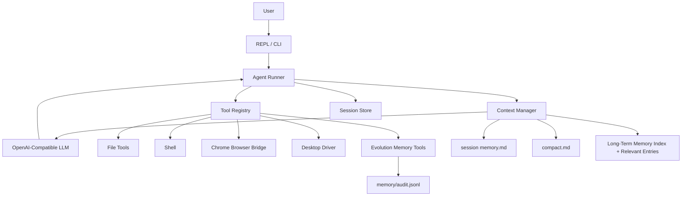

<div align="center">
  <h1 align="center">Cohert</h1>
  <p align="center">
    本地优先的命令行 Agent Runtime，支持工具调用、浏览器自动化、桌面感知、长上下文、SOP 和可验证记忆。
  </p>
</div>

<p align="center">
  
  
  
  
  
</p>

<p align="center">
  <b>简体中文</b>
  ·
  <a href="docs/readme/README.en.md">English</a>
  ·
  <a href="docs/readme/README.ja.md">日本語</a>
  ·
  <a href="docs/readme/README.ko.md">한국어</a>
  ·
  <a href="docs/readme/README.es.md">Español</a>
  ·
  <a href="docs/readme/README.fr.md">Français</a>
  ·
  <a href="docs/readme/README.hi.md">हिन्दी</a>
</p>

<p align="center">
  <a href="#快速开始">快速开始</a>
  ·
  <a href="#核心能力">核心能力</a>
  ·
  <a href="#架构">架构</a>
  ·
  <a href="#工具">工具</a>
  ·
  <a href="docs/usage.md">使用教程</a>
</p>

---

## Cohert 是什么

Cohert 是一个用 Go 编写的本地 Agent Runtime。它把 OpenAI-compatible LLM、受控工具层、持久会话、浏览器自动化、桌面 Computer Use、上下文压缩、SOP 路由和可验证长期记忆接在一起。

它不是纯聊天壳，而是面向真实本地工作的执行运行时：

```text
用户意图
  -> Agent Loop
  -> Context Manager
  -> LLM Tool Calling
  -> 本地工具 / 浏览器 / 桌面 / Shell
  -> 证据记录
  -> 会话历史与可验证记忆
```

核心原则：模型负责推理，执行必须显式、可审计、可恢复，并且长期记忆必须有工具证据支撑。

## 快速开始

```bash
git clone <repo-url>
cd Cohort
export DEEPSEEK_API_KEY="sk-xxx"
go run .
```

执行一次性任务：

```bash
go run . ask "读取 README.md 并总结当前运行时能力"
```

查看运行状态：

```bash
go run . config
go run . tools
go run . session list
```

构建二进制：

```bash
go build -o cohert ./cmd/cohert
./cohert
```

默认配置在 [`configs/config.yaml`](configs/config.yaml)，完整使用说明见 [`docs/usage.md`](docs/usage.md)。

## 核心能力

| 领域 | 能力 |
| --- | --- |
| Agent Loop | 流式 OpenAI-compatible 对话、工具调用、最大轮次控制、可见行动说明 |
| 本地工具 | 文件读写、patch、shell 执行、向用户提问、结构化工具错误 |
| 浏览器自动化 | Chrome bridge、打开/扫描页面、JS 执行、元素快照、点击、输入、按键、等待、截图、OCR |
| 桌面 Computer Use | macOS 权限检查、窗口枚举、PID 激活、窗口截图、AX 控件树、桌面 OCR、受控 `AXPress` 和受限按键 |
| 会话系统 | `history.jsonl`、元数据、session 列表、恢复、本地审计轨迹 |
| 上下文管理 | 工具结果压缩、消息组安全裁剪、session memory、full compact 摘要 |
| SOP Runtime | SOP 索引注入、任务场景路由、读取 SOP 后写入工作 checkpoint |
| Evolution Memory | 工具证据、结构化记忆、项目记忆、去重、回读确认、写入审计 |
| 可观测性 | 模型响应日志、上下文统计日志、memory audit 记录 |

## 命令

外部 CLI：

```bash
cohert                         # 进入交互模式
cohert ask "task"              # 执行一次任务后退出
cohert tools                   # 查看已挂载工具
cohert config                  # 查看有效配置
cohert session list            # 查看本地会话
cohert session resume <id>     # 恢复会话
```

开发入口：

```bash
go run .
go run . ask "task"
go run . tools
go run . config
```

交互模式 slash 命令：

```text
/help
/model
/config
/tools
/session
/session list
/session memory
/resume <session_id>
/compact
/full-compact
/memory
/clear
/exit
```

## 架构



| 层 | 包 | 职责 |
| --- | --- | --- |
| 应用装配 | `internal/app` | 配置、LLM client、工具注册、系统提示 |
| Agent Loop | `internal/agent` | 工具调用循环、历史、compact、证据收集 |
| Context Manager | `internal/contextmgr` | 请求构造、上下文压缩、记忆注入 |
| 工具运行时 | `internal/tools` | 文件、命令、浏览器、桌面、记忆、checkpoint 工具 |
| 浏览器桥 | `internal/browser` | Cohert 与 Chrome 扩展的 WebSocket 协议 |
| 桌面驱动 | `internal/desktop` | macOS desktop helper 的 Go 接口与 JSON runner |
| 会话存储 | `internal/session` | `meta.json`、`history.jsonl`、列表和恢复 |
| 进化记忆 | `internal/evolution` | 记忆校验、写入、审计 |

## 工具

<details>
<summary>当前注册工具</summary>

```text
file_read
file_write
file_patch
code_run
ask_user
update_working_checkpoint
start_long_term_update
memory_propose_update
memory_apply_update
browser_tabs
browser_open
browser_scan
browser_dom_summary
browser_execute_js
browser_click
browser_click_element
browser_type
browser_type_element
browser_press_key
browser_snapshot
browser_wait_for_load
browser_wait_for_selector
browser_wait_for_text
browser_wait_for_url
browser_wait_for_stable
browser_screenshot
browser_ocr
desktop_permissions
desktop_windows
desktop_activate
desktop_screenshot
desktop_ax_snapshot
desktop_ocr
desktop_ax_press
desktop_press_key
```

</details>

## 浏览器自动化

Cohert 通过本地 Browser Bridge 控制真实 Chrome：

```text
ws://127.0.0.1:18777/browser
```

推荐流程：

```text
open
  -> wait for load
  -> wait for stable state
  -> snapshot interactive elements
  -> click / type / press key
  -> wait for selector / text / URL / stable state
  -> verify result
```

当 DOM 文本和 `browser_dom_summary` 都无法读取渲染文字时，`browser_ocr` 可以读取 workspace 图片，或自动截取当前浏览器视口。OCR 返回 `screenshot-local` bbox，不执行点击。

OCR 可选依赖：

```bash
python3 -m pip install rapidocr-onnxruntime pillow numpy
```

如果浏览器工具返回 `browser_not_connected`，请加载 Chrome 扩展：

```text
assert/cohert_browser_bridge
```

## 桌面 Computer Use

Cohert 已具备 macOS 通用桌面感知与受控 AX 语义动作，不绑定具体应用：

```text
desktop_permissions
  -> desktop_windows
  -> desktop_activate
  -> desktop_ax_snapshot
  -> desktop_screenshot
  -> desktop_ocr
  -> desktop_ax_press
  -> desktop_press_key
```

优先使用 Accessibility / AX 控件树；AX 不可用时才使用截图和 OCR。`desktop_ax_press` 要求目标 PID 已在前台，并使用刚刚读取的 AX 节点 metadata 重新校验节点，动作后再读取 AX 快照验证状态变化。`desktop_press_key` 只支持受限按键集合：`Escape`、`Tab`、`Shift+Tab`、方向键、`PageUp/PageDown`、`Home/End` 可直接执行；`Enter`、`Cmd+Enter`、`Ctrl+Enter`、`Delete`、`Backspace` 等必须确认。

风险策略：

- R1 可恢复操作：可直接执行，例如展开、收起、菜单、tab。
- R2 外部副作用：必须由 `ask_user` 签发一次性确认令牌，例如发送、提交、上传、保存、发布或提交/删除类按键。
- R3 高风险：自动拒绝，要求用户手动完成，例如支付、审批、授权、登录验证、删除。

当前仍没有桌面坐标点击或文本输入工具。截图和 OCR bbox 是 `screenshot-local`，不能当作系统鼠标坐标。

macOS helper 依赖：

```bash
python3 -m pip install pyobjc-framework-Quartz pyobjc-framework-Cocoa pyobjc-framework-ApplicationServices
```

使用桌面能力前，请在 macOS 系统设置中给运行 Cohert 的终端或 IDE 授权 Accessibility 和 Screen Recording。

## 上下文与会话

Cohert 会完整保存历史，但每次请求模型前会构造受控上下文窗口。

它可以：

- 丢弃协议非法的 orphan tool result。
- 注入长期记忆索引与命中的相关 entry。
- 注入 session `memory.md`。
- 注入 session `compact.md`。
- 压缩旧工具结果，只保留头尾摘要。
- 按消息组裁剪旧历史，避免拆散 tool-call 协议对。

会话保存在：

```text
temp/sessions/<session_id>/
  meta.json
  history.jsonl
  memory.md
  compact.md
```

`history.jsonl` 是事实来源。上下文压缩只影响发给模型的请求副本，不会改写完整历史。

## SOP Runtime

Cohert 把 SOP 当作轻量执行约束。系统提示只注入 [`sops/index.md`](sops/index.md) 作为导航，不把所有 SOP 全量塞进上下文。

任务命中某个 SOP 场景时，Runner 会提示模型先读取对应 SOP。如果采用该 SOP，应调用：

```text
update_working_checkpoint
```

能力分层：

```text
C0 原子工具
  -> C1 SOP 约束
  -> C2 工作 checkpoint
  -> C3 已验证长期记忆 entry
  -> C4 SOP candidate
  -> C5 已审查 SOP / Skill in sops/index.md
```

这样可以把可复用流程沉淀下来，同时避免把一次性任务直接升级成主动规则。

## 记忆

Cohert 的长期记忆流程是受控三步：

```text
start_long_term_update
  -> memory_propose_update
  -> memory_apply_update
```

记忆存储在 workspace 下：

```text
workspace/
  memory/
    index.md
    global.md
    projects/
      <project_id>/
        project.md
    reflection/
      sop_candidates.md
    audit.jsonl
```

写入规则：

- 必须引用工具执行过程中收集到的已验证证据。
- 只允许 append。
- 拒绝敏感内容。
- 拒绝重复记忆。
- 写入成功前必须回读确认。
- 每次 apply 都写审计记录。

稳定流程可以进入：

```text
memory/reflection/sop_candidates.md
```

它不会自动变成正式 SOP。晋级仍然需要显式审查：

```text
/sop candidates
/sop promote <candidate_id>
/sop promote <candidate_id> --confirm-index
```

## 配置

最小配置：

```yaml
language: zh
workspace: ./workspace
log_dir: ./temp/model_responses
max_turns: 100

llm:
  provider: openai
  name: deepseek
  api_key: ${DEEPSEEK_API_KEY}
  api_base: https://api.deepseek.com
  model: deepseek-v4-pro
  stream: true
```

当前客户端使用 OpenAI-compatible Chat Completions。`deepseek-v4-pro` / `dsv4pro` 会按大上下文模型处理。

## 项目结构

```text
cmd/cohert/             CLI 入口
configs/                本地配置
docs/                   使用教程、设计文档、开发记录
internal/app/           应用装配与系统提示
internal/agent/         Agent loop、compact、证据流
internal/browser/       Chrome bridge server 和协议
internal/cli/           外部 CLI 命令
internal/contextmgr/    请求构造、压缩、记忆注入
internal/desktop/       桌面驱动接口与 Python helper runner
internal/evolution/     记忆校验、写入、审计
internal/llm/           OpenAI-compatible LLM client
internal/repl/          交互 shell 和 slash 命令
internal/session/       session 元数据和历史存储
internal/tools/         文件、命令、浏览器、桌面、记忆工具
sops/                   SOP 索引和执行手册
workspace/              默认本地 workspace
temp/                   session 和运行日志
assert/                 浏览器 bridge 扩展资源
```

## 开发

```bash
go test ./...
go vet ./...
go run . tools
go run . config
```

## 设计原则

- 本地优先：执行、浏览器控制、桌面感知、会话、日志和记忆默认都在本地。
- 工具可审计：动作通过 schema、结构化输出和明确错误流转。
- 历史不可变：即使请求上下文被压缩，`history.jsonl` 也保留完整记录。
- 上下文分层：SOP、session memory、full compact 和长期记忆各司其职。
- 记忆可验证：长期记忆需要证据，模型猜测不能变成事实。
- 渐进演化：先稳定运行时，再扩展 UI、插件、多 Agent 编排或更重的检索。
