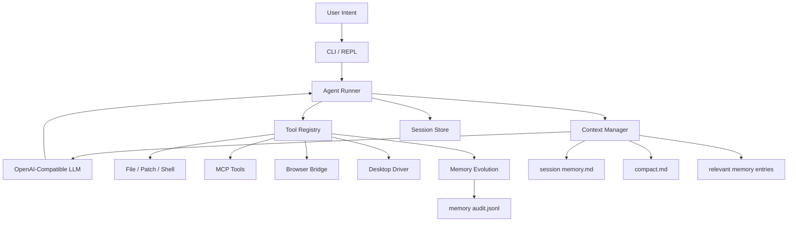

<div align="center">
  <h1 align="center">Cohert</h1>
  <p align="center">
    <strong>The Runtime Layer Between LLMs and Real Work</strong>
  </p>
  <p align="center">
    为真实世界的 Agent 提供本地优先的执行内核。
    <br />
    连接模型推理、工具调用、浏览器、桌面、MCP、上下文治理与可验证记忆，
    <br />
    让智能体从“会回答”进化为“能工作”。
  </p>
</div>

<p align="center">
  
  
  
  
  
  
  
</p>

<p align="center">
  <b>简体中文</b>
  ·
  <a href="docs/readme/README.en.md">English</a>
  ·
  <a href="docs/readme/README.ja.md">日本語</a>
  ·
  <a href="docs/readme/README.ko.md">한국어</a>
  ·
  <a href="docs/readme/README.es.md">Español</a>
  ·
  <a href="docs/readme/README.fr.md">Français</a>
  ·
  <a href="docs/readme/README.hi.md">हिन्दी</a>
</p>

<p align="center">
  <a href="#项目叙事">项目叙事</a>
  ·
  <a href="#为什么是-cohert">为什么是 Cohert</a>
  ·
  <a href="#快速开始">快速开始</a>
  ·
  <a href="#能力矩阵">能力矩阵</a>
  ·
  <a href="#系统架构">系统架构</a>
  ·
  <a href="#安全模型">安全模型</a>
  ·
  <a href="#项目结构">项目结构</a>
  ·
  <a href="docs/usage.md">使用文档</a>
</p>

---

> 我们并不缺新的聊天框。  
> 我们缺的是一个足够可靠的运行时层, 让模型的判断可以穿过工具、浏览器、桌面和长期任务，真正抵达现实世界。

## 项目叙事

过去两年，Agent 领域最热闹的部分往往也是最脆弱的部分。

模型已经能写代码、能读网页、能理解复杂目标，甚至能在 benchmark 里看起来像一个“会做事的人”。  
但一旦进入真实环境，问题很快暴露出来:

- 它知道下一步该做什么，却没有稳定的执行路径。
- 它可以调用工具，却没有足够强的约束、审计和恢复机制。
- 它能记住一点东西，却记不清什么是事实、什么只是一次成功的幻觉。
- 它能跑一段 demo，却很难跨过长任务、长上下文和真实副作用的门槛。

这就是 Cohert 想解决的核心矛盾。

我们不是把大模型再包一层 UI，也不是再做一个提示词更花哨的 Agent 壳。  
我们想做的是更底层的一层东西: 一个真正意义上的 <strong>Agent Runtime</strong>。

它的职责不是替模型思考，而是替系统建立秩序:

- 给推理一个可执行的落点。
- 给工具一个统一、受控、可恢复的运行边界。
- 给长任务一个不会失控的上下文系统。
- 给记忆一个可以被验证、被审计、被演化的生命周期。

如果说大模型提供的是 intelligence，  
那么 Cohert 试图补上的，是 intelligence 落地之前最缺的那层 infrastructure。

## 为什么是 Cohert

大部分 Agent Demo 的问题不是“不会想”，而是“不能稳定做事”。

- 模型能调用工具，但执行链路不可审计。
- 上下文越来越长，最后只能硬截断。
- 浏览器和桌面自动化混在 prompt 里，失败后很难恢复。
- 记忆是模型随手写下的摘要，不是有证据的事实。

Cohert 的判断很明确:

> 真正可用的 Agent，不该建立在“模型这次刚好没出错”的侥幸上。  
> 它应该建立在 runtime 的边界、证据、恢复能力和长期演化能力之上。

所以 Cohert 的目标不是炫技式地证明“模型能做到什么”，而是工程化地回答另一个问题:

**当 Agent 进入真实工作流之后，它如何持续、稳定、可追踪地完成任务。**

| 方向 | Cohert 的处理方式 |
| --- | --- |
| 执行 | 用受控工具层连接文件、Shell、浏览器、桌面、MCP |
| 长任务 | 用 session、compact、memory 分层管理长上下文 |
| 可恢复 | 每次任务都有 `history.jsonl` 和 session 元数据 |
| 可验证 | 长期记忆必须引用工具证据，写入后回读确认 |
| 自动化 | 浏览器优先 DOM，桌面优先 AX，避免纯视觉瞎点 |
| 演化 | SOP、checkpoint、memory candidate 分层升级，而不是一次性 prompt 魔法 |

换句话说，Cohert 关心的不是“像不像人”，而是更底层也更重要的三件事:

- 能不能安全地行动。
- 能不能在失败后恢复。
- 能不能把一次性的成功沉淀成长期能力。

## 快速开始

### 1. 一键安装到用户目录

macOS 可以用一条命令安装：

```bash
curl -fsSL https://raw.githubusercontent.com/congchuanling-dot/Cohort/master/scripts/install.sh | sh -s -- --repo https://github.com/congchuanling-dot/Cohort.git
```

如果已经在仓库根目录，也可以直接执行：

```bash
./scripts/install.sh
export PATH="$HOME/.cohert/bin:$PATH"
export DEEPSEEK_API_KEY="sk-xxx"
cohert config
cohert doctor
cohert
```

安装脚本会优先下载 GitHub Release 里的 macOS 二进制；如果 release 不可用，
才回退到源码构建。最终会安装到 `~/.cohert/bin/cohert`，并在
`~/.cohert/config.yaml` 初始化用户级配置。脚本不会写入 API key。macOS zsh
下会自动把 `~/.cohert/bin` 写入 `~/.zshrc`；如不希望修改 shell 配置，可加
`--no-shell`。

也可以手动初始化或覆盖用户级配置：

```bash
cohert init --provider deepseek
cohert init --provider anthropic --force
```

### 2. 本地开发运行

```bash
git clone <repo-url>
cd Cohort
export DEEPSEEK_API_KEY="sk-xxx"
go run .
```

### 3. 执行一次性任务

```bash
go run . ask "读取 README.md，并总结当前 runtime 的核心能力"
```

### 4. 查看当前运行状态

```bash
go run . config
go run . doctor
go run . doctor computer
go run . tools
go run . mcp list
go run . mcp status
go run . skill install ./path/to/skill
go run . skill install --yes ./path/to/skill
go run . skill install --pin v1.2.3 https://example.com/org/skill-repo.git
go run . skill doctor project/<skill_name>
go run . skill update --check project/<skill_name>
go run . skill update project/<skill_name>
go run . skill uninstall project/<skill_name>
go run . skill list
go run . session list
```

`doctor computer` 会检查 macOS Accessibility、Screen Recording、desktop helper、OCR helper、Chrome bridge 和 artifact 目录；默认只读诊断，不会点击、输入或修改系统设置。

### 5. 构建二进制

```bash
go build -o cohert ./cmd/cohert
./cohert
```

默认项目配置见 [configs/config.yaml](/Users/bytedance/Desktop/myOwnProject/Cohort/configs/config.yaml)。全局运行时会按 `--config`、`COHERT_CONFIG`、项目配置、`~/.cohert/config.yaml` 的顺序查找配置。更完整的命令和 REPL 说明见 [docs/usage.md](/Users/bytedance/Desktop/myOwnProject/Cohort/docs/usage.md)。

## 能力矩阵

| 模块 | 真实能力 | 解决的问题 |
| --- | --- | --- |
| Agent Loop | 流式对话、工具调用、最大轮次控制、行动说明 | 让模型真正进入可执行闭环 |
| Local Tools | 文件读写、补丁、命令执行、用户确认 | 处理真实仓库和本地环境 |
| MCP Runtime | 兼容 `.mcp.json`、stdio/HTTP server、动态发现工具 | 接入外部系统而不是只活在本地 |
| Browser Automation | Chrome Bridge、DOM 扫描、点击、输入、等待、截图、OCR | 支撑真实 Web 工作流 |
| Desktop Computer Use | macOS 权限检查、窗口激活、AX 控件树、受控点击、键盘、起草输入 | 让 Agent 能跨浏览器外的桌面界面行动 |
| Context Manager | 工具结果压缩、消息组裁剪、session memory、full compact | 让长任务不被上下文拖死 |
| Session Store | `meta.json`、`history.jsonl`、resume、local audit trail | 让任务可以中断后继续 |
| SOP Runtime | SOP 索引、任务路由、工作 checkpoint | 把稳定流程固化成可复用约束 |
| Skill Runtime | `skill install` 预览确认安装、`skill install --yes`、`skill install --dry-run`、`skill update --check`、`--pin` 版本锁定、`skill doctor`、manifest hash、`.cohort/skills`、`~/.cohert/skills`、`skill_read`、`/skill run`、`/<skill-alias>` | 像 Claude Code 一样安装、校验、锁定版本并按需加载可复用工作流 |
| Evolution Memory | 证据约束、去重、项目记忆、审计日志 | 让“长期记忆”从摘要变成资产 |

## 一个完整任务是怎么跑起来的



从用户输入到最终结果，Cohert 实际做的是这几件事：

1. 读取当前 session、历史和上下文预算。
2. 把 relevant memory、session memory、compact 摘要按层注入请求。
3. 交给 OpenAI-compatible 模型做工具调用决策。
4. 在受控工具层执行文件、Shell、浏览器、桌面或 MCP 操作。
5. 把执行证据和工具结果写回历史。
6. 在需要时压缩上下文、更新 checkpoint，或触发长期记忆写入流程。

## 为什么它不像玩具

### 1. 浏览器自动化不是截图脚本

Cohert 通过本地 Browser Bridge 控制真实 Chrome:

```text
ws://127.0.0.1:18777/browser
```

推荐流程是稳定的浏览器动作链，而不是“看一眼就点”：

```text
open
  -> wait_for_load
  -> wait_for_stable
  -> snapshot / dom_summary
  -> click / type / press_key
  -> wait_for_selector / text / url
  -> verify
```

只有在 DOM 文本拿不到内容时，才降级到 `browser_ocr`。OCR 返回的是 `screenshot-local` bbox，不直接变成系统鼠标坐标。

Chrome 扩展路径：

```text
assert/cohert_browser_bridge
```

### 2. 桌面自动化不是任意乱点

Cohert 当前的桌面能力基于 macOS Accessibility / AX，目标是做“受控的语义动作”，不是暴露一个危险的任意坐标点击器。

```text
desktop_permissions
  -> desktop_windows
  -> desktop_activate
  -> desktop_ax_snapshot
  -> desktop_screenshot
  -> desktop_ocr
  -> desktop_ax_press
  -> desktop_ax_focus
  -> desktop_click
  -> desktop_visual_click
  -> desktop_press_key
  -> desktop_type_text
```

默认策略：

- 优先 AX 控件树，只有 AX 不可用时才退到截图和 OCR。
- `desktop_type_text` 只负责起草文本，不直接发送。
- `desktop_press_key` 使用受限按键集合。
- 高风险动作直接拒绝，外部副作用动作要求显式确认。

### 3. 长期记忆不是模型随手写便签

长期记忆遵循严格三步流程：

```text
start_long_term_update
  -> memory_propose_update
  -> memory_apply_update
```

写入约束：

- 必须引用已验证的工具证据。
- 必须做去重和敏感信息过滤。
- 成功写入前必须回读确认。
- 每次 apply 都写审计记录。

这意味着 Cohert 的 memory 更像可追踪知识库，而不是一堆不可验证的 prompt summary。

### 4. 上下文不会失控

每次请求模型前，Cohert 会构造一个受控上下文窗口，而不是盲目把所有历史都拼进去。它会：

- 清理协议非法的 orphan tool result。
- 注入 relevant memory 和 session memory。
- 注入 `compact.md` 作为长任务摘要。
- 压缩旧工具结果，只保留头尾高价值片段。
- 按消息组裁剪历史，避免拆坏 tool-call 协议对。

session 目录结构：

```text
temp/sessions/<session_id>/
  meta.json
  history.jsonl
  memory.md
  compact.md
```

`history.jsonl` 始终是事实来源。压缩只影响发送给模型的请求副本，不改写原始历史。

## 系统架构

| 层 | 目录 | 职责 |
| --- | --- | --- |
| App Assembly | `internal/app` | 配置加载、LLM client、工具注册、系统提示 |
| Agent Runtime | `internal/agent` | 工具调用循环、运行日志、compact、证据收集 |
| Context Manager | `internal/contextmgr` | 请求构造、预算控制、裁剪、记忆注入 |
| Tool Runtime | `internal/tools` | 文件、命令、浏览器、桌面、记忆和 checkpoint 工具 |
| Browser Bridge | `internal/browser` | Chrome Bridge 的 WebSocket 协议与服务端实现 |
| Desktop Driver | `internal/desktop` | macOS helper 的 Go 接口与 runner |
| Session Store | `internal/session` | session 列表、恢复、历史与元数据 |
| LLM Client | `internal/llm` | OpenAI-compatible Chat Completions client |
| MCP | `internal/mcp` | server 管理、权限缓存、配置持久化 |
| REPL / CLI | `internal/repl`, `internal/cli` | 交互式 shell、slash 命令、CLI 入口 |
| Verified Memory | `internal/evolution` | 记忆校验、apply、审计 |

## CLI 与交互命令

### 外部 CLI

```bash
cohert                         # 进入交互模式
cohert ask "task"              # 执行一次任务后退出
cohert tools                   # 查看已挂载工具
cohert config                  # 查看有效配置
cohert mcp list                # 查看 MCP server
cohert mcp status              # 检查 MCP server 连通性
cohert mcp add <name> -- ...   # 添加 stdio MCP server
cohert mcp tools <name>        # 查看 server 提供的工具
cohert mcp probe <name>        # 探测 server 可用性
cohert mcp remove <name>       # 删除 MCP server
cohert session list            # 查看本地 session
cohert session resume <id>     # 恢复 session
```

### 交互模式 Slash Commands

```text
/help
/model
/config
/tools
/session
/session list
/session memory
/resume <session_id>
/compact
/full-compact
/memory
/sop candidates
/sop promote <id>
/clear
/exit
```

<details>
<summary>当前注册工具</summary>

```text
file_read
file_write
file_patch
code_run
ask_user
update_working_checkpoint
start_long_term_update
memory_propose_update
memory_apply_update
browser_tabs
browser_open
browser_scan
browser_dom_summary
browser_execute_js
browser_click
browser_click_element
browser_type
browser_type_element
browser_press_key
browser_snapshot
browser_wait_for_load
browser_wait_for_selector
browser_wait_for_text
browser_wait_for_url
browser_wait_for_stable
browser_screenshot
browser_ocr
desktop_permissions
desktop_windows
desktop_activate
desktop_screenshot
desktop_ax_snapshot
desktop_ocr
desktop_ax_press
desktop_ax_focus
desktop_click
desktop_visual_click
desktop_press_key
desktop_type_text
computer_see
computer_find
computer_click
computer_double_click
computer_right_click
computer_type
computer_press
computer_wait
computer_check
computer_scroll
computer_drag
computer_clipboard_write
computer_paste
computer_window_switch
```

</details>

## 安全模型

自动化如果没有边界，最终一定会变成事故放大器。Cohert 的策略是把风险前置到 runtime，而不是把判断完全留给模型。

风险分级：

- `R1` 可恢复动作：允许直接执行，例如展开、切换、菜单、Tab 导航。
- `R2` 外部副作用：必须通过 `ask_user` 获得一次性确认令牌，例如发送、提交、上传、保存、发布。
- `R3` 高风险动作：直接拒绝，例如支付、审批、授权、删除、登录验证。

这套规则同时作用在浏览器、桌面和需要副作用确认的执行链路上。

## 配置

最小配置如下，已经和仓库默认值保持一致：

```yaml
language: zh
workspace: ./workspace
log_dir: ./temp/model_responses
max_turns: 100

llm:
  provider: openai
  name: deepseek
  api_key: ${DEEPSEEK_API_KEY}
  api_base: https://api.deepseek.com
  model: deepseek-v4-pro
  stream: true
  connect_timeout_seconds: 10
  read_timeout_seconds: 120
  max_retries: 2

context:
  max_history_messages: 40
  keep_recent_tool_results: 2
  max_tool_result_chars: 12000
  compacted_tool_head_chars: 4000
  compacted_tool_tail_chars: 4000
  max_request_chars: 100000
  max_session_memory_chars: 20000
  max_compact_summary_chars: 60000
  enable_micro_compact: true
```

当前模型接入层使用 OpenAI-compatible Chat Completions，默认模型为 `deepseek-v4-pro`。

## 项目结构

```text
cmd/cohert/             CLI 入口
configs/                本地配置
docs/                   使用教程、技术设计、开发记录
assert/                 浏览器 bridge 扩展资源
internal/app/           应用装配与系统提示
internal/agent/         Agent loop、证据流、compact
internal/browser/       Chrome Bridge 协议与服务
internal/cli/           命令分发和 CLI 子命令
internal/contextmgr/    请求构造、裁剪、记忆注入
internal/desktop/       桌面驱动与 helper runner
internal/evolution/     长期记忆演化与审计
internal/llm/           OpenAI-compatible client
internal/mcp/           MCP server 管理
internal/repl/          交互 shell 和 slash 命令
internal/session/       session 存储与恢复
internal/tools/         全部受控工具
sops/                   SOP 索引和执行手册
workspace/              默认工作区与长期记忆目录
temp/                   session、日志和运行时输出
```

## 文档索引

- [docs/usage.md](/Users/bytedance/Desktop/myOwnProject/Cohort/docs/usage.md): 使用方法、命令、session 恢复
- [docs/context_management_design.md](/Users/bytedance/Desktop/myOwnProject/Cohort/docs/context_management_design.md): 上下文裁剪与 compact 设计
- [docs/browser_operation_design.md](/Users/bytedance/Desktop/myOwnProject/Cohort/docs/browser_operation_design.md): 浏览器操作设计
- [docs/desktop_computer_use_technical_design.md](/Users/bytedance/Desktop/myOwnProject/Cohort/docs/desktop_computer_use_technical_design.md): 桌面 Computer Use 技术设计
- [docs/cohort_mcp_integration_design.md](/Users/bytedance/Desktop/myOwnProject/Cohort/docs/cohort_mcp_integration_design.md): MCP 集成设计
- [docs/cohort_self_evolution_research.md](/Users/bytedance/Desktop/myOwnProject/Cohort/docs/cohort_self_evolution_research.md): 自演化与记忆方向研究

## 开发与测试

### 本地开发

```bash
go run . config
go run . tools
go run . ask "读取 configs/config.yaml 并解释关键字段"
```

### 测试

```bash
./internal/tests/run.sh
go vet ./...
```

如果只想跑某一类测试：

```bash
./internal/tests/run.sh -run TestDesktop -count=1
```

## 设计原则

- 本地优先：执行、日志、历史、会话、截图、记忆默认留在本地。
- 工具优先：让模型负责推理，让 runtime 负责约束和执行。
- 历史不可变：即使上下文被压缩，`history.jsonl` 仍然保留完整事实。
- 上下文分层：recent history、session memory、compact、relevant memory 各司其职。
- 记忆可验证：没有工具证据的“经验”不能直接进入长期记忆。
- 渐进演化：先把单 Agent runtime 做稳，再考虑更重的编排、UI 和生态。

## 非目标

为了让边界更清楚，下面这些不是 Cohert 当前要解决的问题：

- 不是云端托管 Agent 平台。
- 不是无约束的自动点击机器人。
- 不是“所有信息都塞进 prompt”的长上下文捷径。
- 不是靠模型自由发挥写记忆的黑盒系统。

## 结语

如果你想做的是一个真正能落地的本地 Agent 系统，而不是一个只会说“我可以帮你”的聊天界面，Cohert 的重点就在这里：

- 有执行闭环。
- 有上下文治理。
- 有审计和恢复。
- 有可以进化但不失控的记忆体系。

这正是它和普通 Agent Demo 拉开差距的地方。

## Skill 系统

Cohert 的 Skill 是可安装、可发现、可按需读取的工作流包。启动时只把 Skill 摘要注入系统提示词；真正命中任务后，模型再通过 `skill_read` 读取完整 `SKILL.md`。

常用命令：

```bash
go run . skill install ./path/to/skill
go run . skill install --yes ./path/to/skill
go run . skill install --dry-run ./path/to/skill
go run . skill install --pin v1.2.3 https://example.com/org/skill-repo.git
go run . skill doctor project/<skill_name>
go run . skill update --check project/<skill_name>
go run . skill update --pin v1.2.4 project/<skill_name>
go run . skill update project/<skill_name>
go run . skill uninstall project/<skill_name>
go run . skill list
```

`skill install` 默认会先解析来源、定位 `SKILL.md`、计算文件数、内容 SHA256 和 `requires` 依赖摘要，并展示候选 `SKILL.md` 指令内容，然后提示确认；确认后才写入 `.cohort/skills`。这一步的安全边界是让用户在安装前看到“即将允许 Agent 读取并遵循的指令”，同时确认来源、commit、目标目录、覆盖行为和依赖声明。它不是自动安全审计器，不会替用户判断第三方 Skill 是否可信。

`--yes` 用于脚本或自动化场景，表示预览后直接安装；`--dry-run` 只预览不安装。正式安装会写入 `.cohert-skill.json`，记录 `source`、`source_type`、`source_ref`、`requested_ref`、`resolved_ref`、`pinned`、`scope`、`alias`、`installed_at` 和 `content_hash`。`--pin <git-ref>` 会把 git Skill 锁到解析后的 commit；后续不带参数的 `skill update` 和 `skill update --check` 会继续使用这个 commit，除非再次传 `--pin <new-ref>`。`skill doctor` 会检查路径边界、Skill 正文、manifest、hash 漂移和 `requires` 声明的 MCP/env/commands 依赖，适合在更新或手工编辑后做健康检查。

Skill 可以在 `SKILL.md` frontmatter 中声明运行前依赖。Cohert 只解析、展示和诊断这些依赖，不会自动安装命令、添加 MCP Server、申请授权或输出环境变量值。

```yaml
---
name: lark-doc-helper
description: Work with Lark documents.
requires:
  mcp:
    - lark
  env:
    - LARK_APP_ID
    - LARK_APP_SECRET
  commands:
    - npx
---
```
